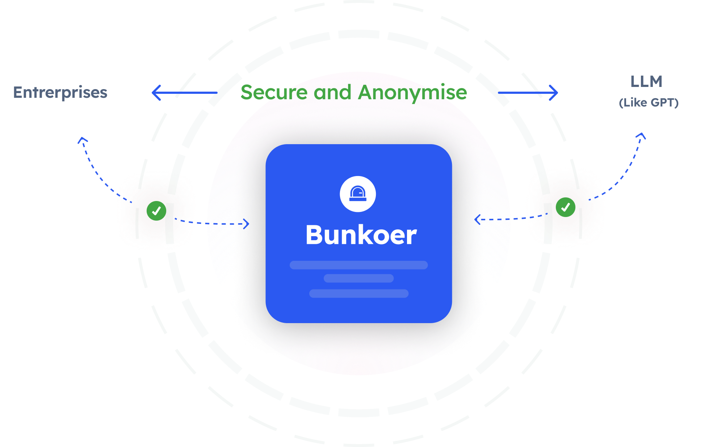

# 🔒🛡️ Bunkoer

⚡ Building Secure LLM Applications Through Composability ⚡

## Warning: Library Under Active Development

Please be aware that this library is currently under active development. As such, it is subject to frequent updates and changes. While we strive to ensure stability and reliability, its rapid evolution means that certain features or behaviors may change without prior notice. We encourage users to stay updated with the latest version, but also advise caution and thorough testing before using this library in production environments.

## Quick Install

Install Bunkoer with pip:

```bash
pip install bunkoer
```
### OpenAI API Key Required

To run the Bunkoer library, an OpenAI API key is necessary. You must obtain this key and export it in your environment variables. Set up the key as follows:

```bash
export OPENAI_API_KEY=your_api_key_here
```

Replace `your_api_key_here` with your actual OpenAI API key. Without this key, the library will not function properly.

## ⚙️ What is Bunkoer?

Bunkoer is a framework designed to secure the development of applications powered by large language models. It offers solutions that:

- **Ensure Privacy**: Bunkoer integrates AI models with mechanisms to safeguard sensitive information, employing anonymization techniques and privacy-preserving prompts.
- **Foster Ethical AI**: The framework leans on AI models to uphold ethical standards, evaluating and modifying responses to maintain privacy and determining appropriate data handling actions.



## How Does Bunkoer Help?

Bunkoer's core strengths include:

- **Modular Features**: Tailored tools and integrations for enhancing data privacy in AI models, designed to be both modular and user-friendly.
- **Pre-configured Anonymization Processes**: Ready-made combinations of features aimed at achieving higher-level privacy tasks.

## How to Use Bunkoer?

### Secure Your Files

Using Bunkoer's security feature, you can anonymize any type of file. Currently, this feature is available for CSV files.

Example in Python:

```python
# Import the security module of Bunkoer
from bunkoer.security import SecureFile 

file_path = "/path/to/your/file.csv"  # Specify the file you want to secure
secured_file = SecureFile(file_path)  # SecureFile function returns the path of the anonymized file
```

[Warning] The Bunkoer library is still under development and testing. Sometimes, the anonymization process may be incorrect. We are not responsible if your data is exposed inadvertently.

### Use Case:

Once your data is secured, you can use it for various purposes. For example, you can process your anonymized data with ChatGPT. To do this, you can use our repository [bunkoer x streamlit](https://github.com/Bunkoer/bunkoer-x-streamlit).

### Coming Soon:

- Support for file types: JSON, SQL
- Streamlined anonymization API

### Optimize Your Anonymized File

- Coming soon

## Contact
For any queries or further information, please open an issue in the GitHub repository.

If you are interrested to work with us contact us on Linkedin : https://www.linkedin.com/company/bunkoer/ 
or by email : bunkoer@bunkoer.com

## License

Permission is hereby granted, free of charge, to any person obtaining a copy of this software and associated documentation files (the "Bunkoer Software"), to deal in the Bunkoer Software without restriction, including without limitation the rights to use, copy, modify, merge, publish, distribute, sublicense, and/or sell copies of the Bunkoer Software, and to permit persons to whom the Bunkoer Software is furnished to do so, subject to the following conditions:

The Commercial Clause: Notwithstanding the above, the use of the Bunkoer Software for commercial purposes is conditioned upon the conclusion of a separate commercial license agreement. "Commercial use" refers to the use of the Bunkoer Software in a product or service that is sold, rented, or used for the purpose of generating revenue. For inquiries about commercial licenses, please contact us at bunkoer@bunkoer.com.

The above copyright notice and this permission notice shall be included in all copies or substantial portions of the Bunkoer Software.

THE BUNKOER SOFTWARE IS PROVIDED "AS IS", WITHOUT WARRANTY OF ANY KIND, EXPRESS OR IMPLIED, INCLUDING BUT NOT LIMITED TO THE WARRANTIES OF MERCHANTABILITY, FITNESS FOR A PARTICULAR PURPOSE AND NONINFRINGEMENT. IN NO EVENT SHALL THE AUTHORS OR COPYRIGHT HOLDERS BE LIABLE FOR ANY CLAIM, DAMAGES OR OTHER LIABILITY, WHETHER IN AN ACTION OF CONTRACT, TORT OR OTHERWISE, ARISING FROM, OUT OF OR IN CONNECTION WITH THE BUNKOER SOFTWARE OR THE USE OR OTHER DEALINGS IN THE BUNKOER SOFTWARE.
